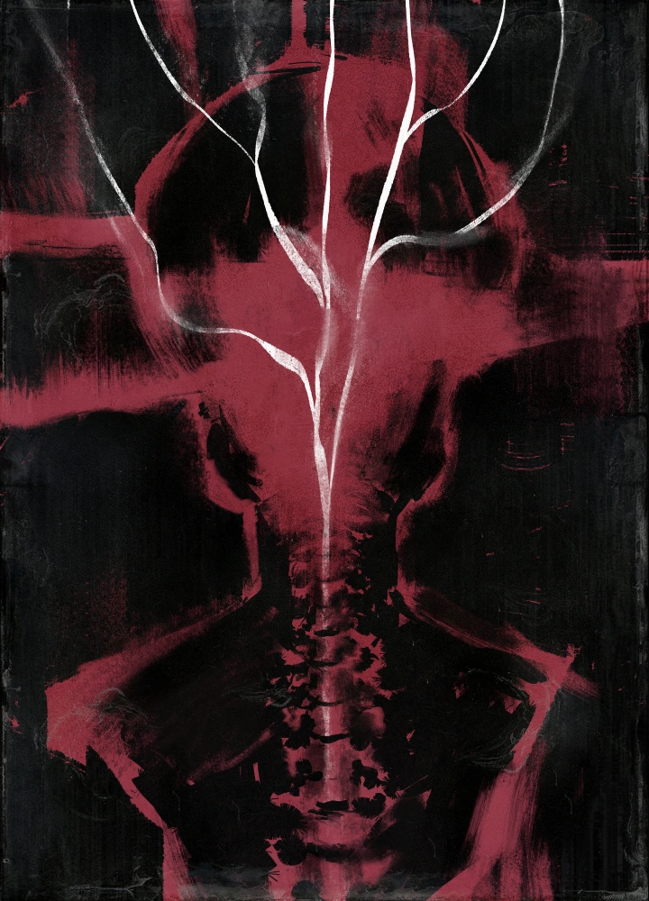
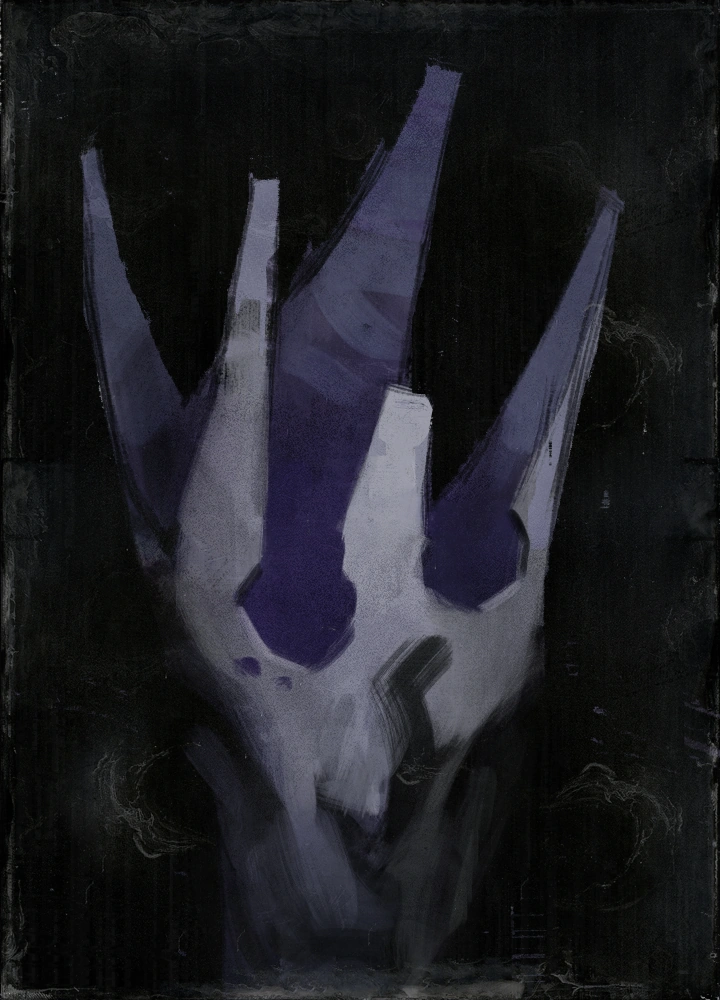

  # *Something Beautiful is Going to Happen*
  
  
  
  
  

   
  

---

# 💫 About Me:

  
  
  &nbsp;&nbsp;&nbsp;&nbsp;&nbsp;&nbsp;&nbsp;&nbsp;&nbsp;&nbsp;&nbsp;&nbsp;
  &nbsp;&nbsp;&nbsp;&nbsp;&nbsp;&nbsp;&nbsp;&nbsp;&nbsp;&nbsp;&nbsp;&nbsp;
  &nbsp;&nbsp;&nbsp;&nbsp;&nbsp;&nbsp;&nbsp;&nbsp;&nbsp;&nbsp;&nbsp;&nbsp;
  &nbsp;&nbsp;&nbsp;&nbsp;&nbsp;&nbsp;&nbsp;&nbsp;&nbsp;&nbsp;&nbsp;&nbsp;
  &nbsp;&nbsp;&nbsp;&nbsp;&nbsp;&nbsp;&nbsp;&nbsp;&nbsp;&nbsp;&nbsp;&nbsp;
  
  

## Proud to work #LikeABosch
 

 

### 🔭 I’m currently working on
- Game Development and Systems architecture.

### 👯 I’m looking to collaborate on
- Nothing a the moment, I'm pretty immersed in my own projects :P

### 🤝 I’m looking for help with
- My Projects

### 🌱 I’m currently learning
- Rust Lang

### 💬 Ask me about
- Disco Elysium, Monster Hunter

### ⚡ Fun fact
- I actually enjoy coding

 

---

## 🌐 Socials:

 

  

 

# 💻 Tech Stack:

  
  ### Just Hacked into your mainframe!
  
  
  
  ### Programming Languages
  
  
  
       
  
  ### Database
  
    
  
  ### Tools & Frameworks
  
      

# 📊 GitHub Stats:

   
  
   
  
  

## ✍️ Random Dev Quote

## 🔝 Top Contributed Repo

---

<!-- Proudly created with GPRM ( https://gprm.itsvg.in ) -->
<!-- I'm lazy :P -->
